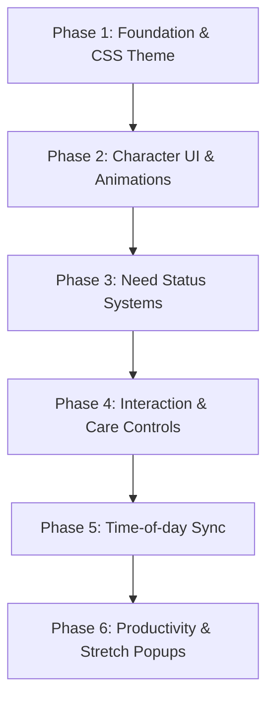

# Digital Desk Pet: Development & Japanese Aesthetic Plan 🐾🌸

A detailed blueprint for building a beautiful, interactive digital companion inspired by traditional and modern Japanese design systems.

---

## 🎨 The Japanese Aesthetic Design System (*Wa-Style* / 和風)

To elevate this app from a simple widget to a premium, serene desktop experience, we base the design system on three core Japanese aesthetic philosophies:

1. **Ma (間 - Negative Space)**: Generous spacing, clean layout padding, and breathing room around elements. Let the pet and the stats exist without visual clutter.
2. **Wabi-Sabi (侘寂 - Organic Simplicity)**: Soft edges, hand-drawn/pixel styles, delicate border structures, and a subtle "washi" (和紙) paper texture background to give a warm, tactile feel.
3. **Shibui (渋い - Understated Elegance)**: Restrained color palettes, high-quality typography, smooth micro-interactions, and status indicators that whisper instead of shouting.

---

### 🍵 Theme Color Schemes (Traditional Palettes)

Below are four cohesive color schemes, mapped to CSS custom variables, that match the traditional Japanese vibe. We will implement them using a global CSS theme switch.

```css
/* ==========================================================================
   CSS CUSTOM VARIABLES SETUP
   ========================================================================== */

/* 1. Spring Sakura & Matcha (春庭 - Spring Garden) - Default Theme */
[data-theme="spring-garden"] {
  --color-bg-base: #FAF8F5;       /* Shiro-paper - Warm rice paper off-white */
  --color-bg-card: #FFFFFF;       /* Pure white */
  --color-border: #E8E2D9;        /* Muted sand */
  --color-text-main: #2C2C2A;     /* Sumi - Charcoal black */
  --color-text-muted: #7E7C74;    /* Ash gray */
  --color-primary: #DB5A6B;       /* Kōbai-iro - Plum/Cherry red */
  --color-primary-light: #FCC9B9; /* Sakura-iro - Soft cherry pink */
  --color-secondary: #7B8D60;     /* Matcha-iro - Green tea green */
  --color-secondary-light: #B8D2A0; /* Young sprout green */
  --color-shadow: rgba(44, 44, 42, 0.04);
}

/* 2. Traditional Indigo (藍染 - Aizome) - Cool Tech Theme */
[data-theme="aizome"] {
  --color-bg-base: #F4F6F9;       /* Light stone blue */
  --color-bg-card: #FFFFFF;       
  --color-border: #D3DBE2;        
  --color-text-main: #1E2A38;     /* Fukaki-ai - Deep Indigo */
  --color-text-muted: #566D82;    /* Slate blue */
  --color-primary: #3B5B75;       /* Mid Indigo */
  --color-primary-light: #A2C0D4; /* Asagi - Pale blue */
  --color-secondary: #E5AF55;     /* Kinpaku - Brushed gold accent */
  --color-secondary-light: #F7DCA3;
  --color-shadow: rgba(30, 42, 56, 0.05);
}

/* 3. Sunset Twilight (黄昏 - Tasogare) - Warm/Calming Theme */
[data-theme="tasogare"] {
  --color-bg-base: #FAF4EB;       /* Warm cream */
  --color-bg-card: #FFFFFF;
  --color-border: #EDDEC9;
  --color-text-main: #3C2F4D;     /* Deep mulberry purple */
  --color-text-muted: #7D6B88;    
  --color-primary: #C34A47;       /* Akane-iro - Madder red */
  --color-primary-light: #EC9560; /* Kaki-iro - Persimmon orange */
  --color-secondary: #E0A96D;     /* Sunset yellow gold */
  --color-secondary-light: #FCEAD2;
  --color-shadow: rgba(60, 47, 77, 0.05);
}

/* 4. Forest Bamboo (森林 - Shinrin) - Earthy/Focus Theme */
[data-theme="shinrin"] {
  --color-bg-base: #ECE7DC;       /* Suna-iro - Warm sand */
  --color-bg-card: #F5F1E8;       
  --color-border: #D4CDBC;        
  --color-text-main: #232524;     /* Ink black */
  --color-text-muted: #626B66;    
  --color-primary: #2B4C3F;       /* Deep bamboo green */
  --color-primary-light: #65826A; /* Koke-iro - Moss green */
  --color-secondary: #9E7E6A;     /* Sugi-iro - Cedar wood */
  --color-secondary-light: #D4BFA8;
  --color-shadow: rgba(35, 37, 36, 0.05);
}
```

---

## 🛠 Feature Roadmap & Implementation Sequence

Here is the step-by-step implementation order, moving from base structure to interactive layers, and finally to scheduling integration.



### Phase 1: Foundation & Theme Architecture
* **Goal**: Establish variables, styles, and the baseline React layout structure.
* **Tasks**:
  1. Add Google Fonts (`Noto Sans JP` / `Outfit` / `Inter`) to [index.html](file:///home/timbla/code/vite-project/index.html).
  2. Implement CSS variables in [index.html](file:///home/timbla/code/vite-project/src/index.css) matching the Japanese traditional palettes.
  3. Create a theme switching context/state (`useTheme`) to toggle between themes.
  4. Design a container wrapper that uses `backdrop-filter: blur()`, rounded container corners, and a faint noise/grain SVG pattern to emulate rice paper.

### Phase 2: Character Frame & Idle Animations (MVP)
* **Goal**: Render the pet and create a living entity on the screen.
* **Tasks**:
  1. Create a `PetCanvas` or `PetSprite` component.
  2. Setup sprite-sheet frames or load SVG components for the pet's animations.
  3. Implement an state-driven animation controller (`PetState`: *idle*, *blink*, *happy*, *sad*, *tired*, *eating*, *sleeping*).
  4. Write a randomized scheduler hook (`useInterval`) to shift the pet's pose (e.g., twitching ears, stretching, shifting weight) every few seconds to make it feel alive.

### Phase 3: The "Needs" Simulation System
* **Goal**: Introduce the core care mechanic to incentivize user engagement.
* **Tasks**:
  1. Setup state hooks/reducers for status values: `hunger` (0-100) and `energy` (0-100).
  2. Create a tick loop that depletes `hunger` (e.g., -1 point every 3 minutes) and `energy` (-1 point every 2 minutes).
  3. Design elegant gauge indicators: minimalist horizontal bars styled like solid paint strokes or thin bamboo shoots, using `--color-secondary` for hunger and `--color-primary` for energy.

### Phase 4: Care Interactions & Feedback Loops
* **Goal**: Enable user input to revive the pet's vitals with interactive feedback.
* **Tasks**:
  1. Create the action dock containing the "Pet", "Feed" (ご飯), and "Sleep" (睡眠) actions.
  2. Map these buttons to actions:
     - **Pet**: Triggers *happy* animation state, releases small floating blossom particles, boosts mood/energy slightly.
     - **Feed**: Subtracts 1 inventory item (or runs a cool eating animation), restores *hunger* (+30).
     - **Sleep**: Puts the pet in a sleeping bubble (💤), starts *sleeping* animation, gradually restores *energy* (+2 per second) while blocking other actions.
  3. Bind state changes to visual cues: if `hunger < 30`, change base animation to *hungry* (visual sweat drop/shivering); if `energy < 30`, change animation to *tired* (laying down, slow eyes).

### Phase 5: Time-of-Day Sync (Circadian Rhythm)
* **Goal**: Connect the pet's world to the user's real environment.
* **Tasks**:
  1. Create a system time detection hook (`useCircadian`).
  2. Divide the day into traditional times:
     - **Dawn (06:00 - 09:00)**: Auto-switch to *Spring Garden* or light cream themes.
     - **Day (09:00 - 17:00)**: Midday theme, bright and clean.
     - **Twilight (17:00 - 20:00)**: Switch to *Sunset Twilight (Tasogare)*.
     - **Night (20:00 - 06:00)**: Switch to *Indigo (Aizome)* or a dedicated Dark Mode where the pet's background turns to starry skies and a small paper lantern glows beside it.

### Phase 6: Productivity Integration & Break Reminders
* **Goal**: Merge workspace helper tools with the pet theme.
* **Tasks**:
  1. Build a gentle notification/stretch timer (every 45 minutes of active keyboard/screen time).
  2. When the timer triggers, show an elegant comic-style dialogue bubble (吹き出し - Fukidashi) above the pet.
  3. The bubble contains gentle advice (e.g., *"Take a matcha break!"*, *"Stretch your arms!"*, *"Look outside for 20 seconds"*).
  4. Offer small rewards: dismissing a stretch reminder grants the pet a "snack" (biscuit/sushi/onigiri) to use in the Care system.

---

## 🎯 Next steps
You can start building the first step or configure the plan in detail.
* **To begin coding immediately**, tell me to start on **Phase 1: Foundation & CSS Theme**.
* **To adjust features or themes**, ask any questions or use the `/grill-me` slash command to align on specific layouts and layouts preferences interactively!
